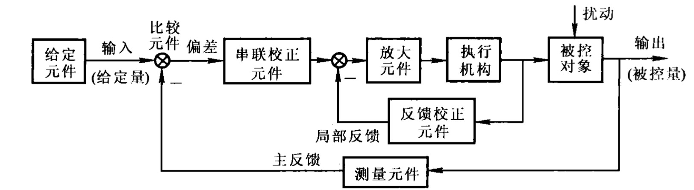
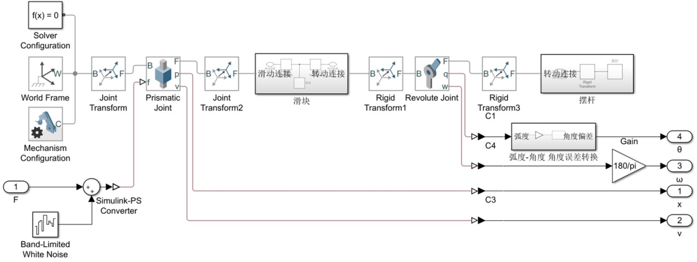

<!-- README的大标题 -->
 

  
  <h3 align="center">优秀控制方法</h3>

  

    学习各种控制方法 用在经典被控对象倒立摆上
	 
	在MATLAB R2019b中搭建模型验证算法

  

----

## 在开始验证控制方法前...
使用simulink中simscape搭建典型被控对象**倒立摆**的真实非线性物理模型

    

将其作为一个subsystem，提供力输入，4个物理量输出作为控制反馈。

## 接下来就可以验证控制方法了

（目前只有目录，后面填坑）

- 经典PID
    - 直立控制
    - 直立控制+位置控制

- 模糊控制
- 模糊自适应PID

    
    

